<p align="center">
  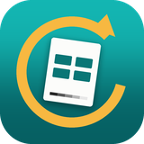
</p>

<a align="center" href="https://www.buymeacoffee.com/mustafa.fbx" target="_blank"></a>

<h1 align="center">MixedMedia Round-Trip Studio</h1>

<p align="center">
  <b>video → kağıt → video</b><br>
  Videoyu karelere bölüp baskıya hazır sayfalar üretir; siz kağıt üzerinde
  çalıştıktan sonra sayfaları tarayıp kareleri doğru sırayla videoya çevirir.
</p>

---

## İçindekiler

- [Ne yapar?](#ne-yapar)
- [Kurulum](#kurulum)
- [İlk açılış](#ilk-açılış)
- [1. Bölüm — Baskıya hazırlama (IMPORT)](#1-bölüm--baskıya-hazırlama-import)
- [2. Bölüm — Kağıt üzerinde çalışma ve tarama](#2-bölüm--kağıt-üzerinde-çalışma-ve-tarama)
- [3. Bölüm — Videoya dönüştürme (EXPORT)](#3-bölüm--videoya-dönüştürme-export)
- [Özel durumlar](#özel-durumlar)
- [Sorun giderme](#sorun-giderme)
- [Komut satırı](#komut-satırı)

---

## Ne yapar?

1. Video, seçtiğiniz kare hızında (örneğin 6 fps) tek tek karelere bölünür.
2. Kareler A4/A3 sayfalara ızgara hâlinde dizilir, baskıya hazır bir PDF çıkar.
3. Siz kağıt üzerinde çizer, boyar, keser, yapıştırırsınız.
4. Sayfaları tarayıp uygulamaya verirsiniz.
5. Her kare bulunur, düzeltilir, kesilir ve **doğru sırayla** videoya çevrilir.

Sıralama hiçbir zaman dosya adına veya tarama sırasına bırakılmaz. Her karenin
sayfa üzerindeki milimetre koordinatı proje dosyasında saklanır; kağıdın üzerine
de köşe işaretleri ve bir QR kodu basılır. Sayfaları karışık sırayla, hatta ters
tarasanız bile uygulama her kareyi yerine oturtur.

---

## Kurulum

### 1. Uygulamayı indirin

Bu deponun **Releases** bölümünden `MixedMedia-windows.zip` dosyasını indirin ve
istediğiniz bir klasöre açın. Kurulum gerekmez — klasördeki
**`MixedMedia.exe`** dosyasına çift tıklamanız yeterli.

Klasörde iki program vardır:

| Dosya | Ne işe yarar |
|---|---|
| `MixedMedia.exe` | Grafik arayüz — normalde bunu kullanacaksınız |
| `mm.exe` | Komut satırı aracı — toplu iş ve otomasyon için |

> **Windows SmartScreen uyarısı:** Program imzalı olmadığı için Windows ilk
> açılışta "Bilinmeyen yayımcı" uyarısı verebilir.
> *Ek bilgi → Yine de çalıştır* ile geçebilirsiniz.

### 2. FFmpeg kurun (zorunlu)

Video okuma ve yazma işlerini FFmpeg yapar ve **uygulamanın içinde gelmez**
(lisansı nedeniyle). Kurmazsanız uygulama açılır ama video ile ilgili hiçbir şey
çalışmaz; ana ekranın altında kırmızı bir uyarı görürsünüz.

En kolay yol — PowerShell'i açıp:

```powershell
winget install Gyan.FFmpeg
```

Kurduktan sonra uygulamayı yeniden başlatın; uyarı kaybolur.

Kurmak istemiyorsanız [ffmpeg.org](https://ffmpeg.org/download.html) adresinden
indirip `ffmpeg` klasörünü **`MixedMedia.exe`'nin yanına** bırakabilirsiniz;
uygulama orayı da arar.

### 3. (İsteğe bağlı) Türkçe karakterler için yazı tipi

PDF'lerdeki alt bilgi metni için sistemden Unicode destekli bir yazı tipi
seçilir. Windows'ta Segoe UI zaten vardır, bir şey yapmanız gerekmez.

---

## İlk açılış

Uygulamayı ilk çalıştırdığınızda dil sorulur. Seçiminiz hatırlanır ve bir daha
sorulmaz.

<p align="center">
  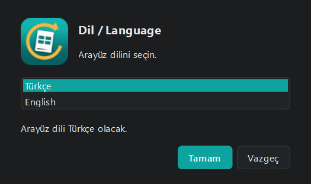
</p>

Dili sonradan değiştirmek isterseniz ana menünün sağ üstündeki **🌐 Türkçe**
düğmesine basmanız yeterli — arayüz anında değişir, yeniden başlatmak gerekmez.

### Ana menü

<p align="center">
  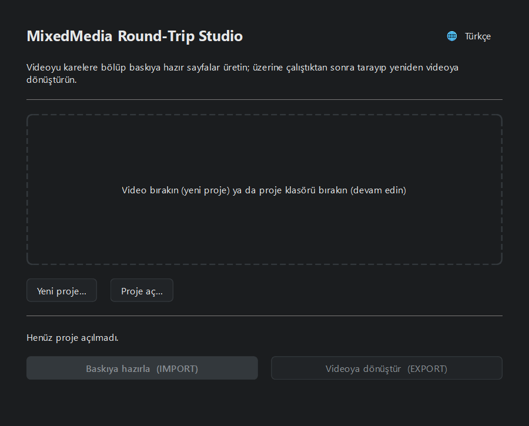
</p>

Buradan iki şey yapabilirsiniz:

- **Yeni proje** — bir video seçip döngüyü baştan başlatmak.
  Ortadaki alana bir video dosyası sürükleyip bırakmanız da yeterli.
- **Proje aç** — daha önce başladığınız bir işe devam etmek.
  Proje klasörünü sürükleyip bırakabilirsiniz.

Bir proje açıkken alttaki iki büyük düğme etkinleşir:

<p align="center">
  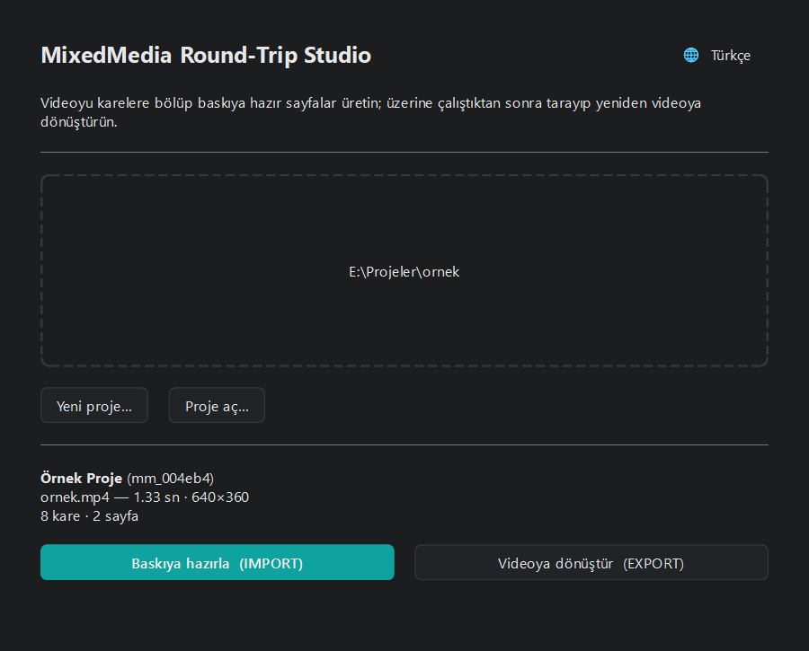
</p>

- **Baskıya hazırla (IMPORT)** — video → kağıt yönü
- **Videoya dönüştür (EXPORT)** — kağıt → video yönü

> Her ayar anında proje klasörüne yazılır. Uygulamayı kapatsanız, hatta
> bilgisayarı yeniden başlatsanız bile iş kaldığı yerden devam eder.

---

## 1. Bölüm — Baskıya hazırlama (IMPORT)

Dört adımlı bir sihirbaz. Her adımda geri dönebilirsiniz.

### Adım 1 — Video

<p align="center">
  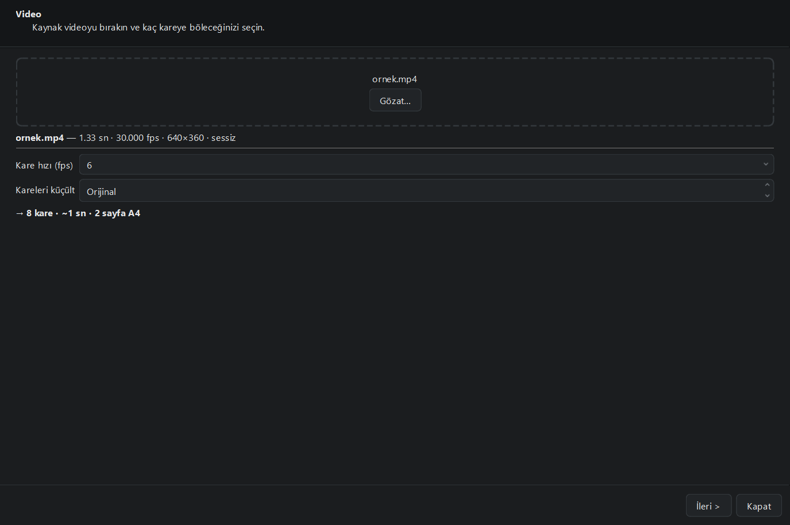
</p>

Videoyu sürükleyip bırakın, sonra **kare hızını** seçin.

**Kare hızı en önemli karardır.** Kaç kare çizeceğinizi bu belirler:

| Kare hızı | 10 saniyelik video | Sonuç |
|---|---|---|
| 4 fps | 40 kare | Kesik kesik, "stop motion" hissi — az emek |
| 6 fps | 60 kare | Klasik el çizimi animasyon temposu (önerilen) |
| 12 fps | 120 kare | Akıcı ama iki katı emek |
| 24 fps | 240 kare | Çok akıcı, çok fazla iş |

Alttaki satır seçiminizin sonucunu anında gösterir:
`→ 48 kare · ~8 sn · 12 sayfa A4`. **Kaç sayfa basacağınızı buradan görün.**

> **Kareleri küçült** alanı, çıkarılan karelerin genişliğini sınırlar. Boş
> bırakın (`Orijinal`) — bu alan yalnızca disk alanından tasarruf etmek içindir,
> baskı kalitesini artırmaz. Kaynak videonuzdan **büyük** bir değer yazmayın,
> görüntüyü gereksiz yere şişirir.

**İleri**'ye bastığınızda kareler çıkarılır. Uzun videolarda bu biraz sürer;
ilerleme çubuğundan takip edebilir, istediğiniz an iptal edebilirsiniz.

### Adım 2 — Görünüm

<p align="center">
  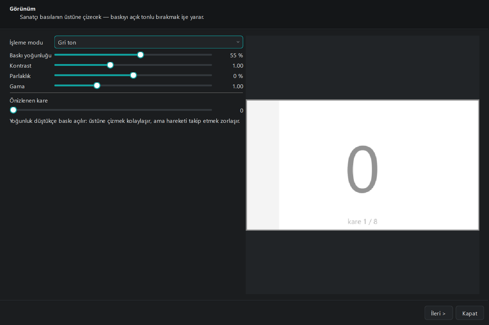
</p>

Kağıda **ne kadar koyu** basılacağını burada ayarlarsınız. Sağdaki önizleme
gerçek bir kare üzerinde anında güncellenir.

Buradaki asıl fikir şu: siz basılanın **üstüne** çizeceksiniz. Baskı ne kadar
açık olursa üstüne çizmek o kadar kolay, ama hareketi takip etmek o kadar zor
olur. Dengeyi kendi çalışma tarzınıza göre kurun.

| Ayar | Ne yapar |
|---|---|
| **İşleme modu** | Orijinal (renkli), Gri ton, Çizgi sanatı, Yarım ton |
| **Baskı yoğunluğu** | En etkili ayar. Düşürdükçe baskı soluklaşır |
| **Kontrast / Parlaklık / Gama** | İnce ayar |

Önerilen başlangıç: **Gri ton** + **%40–55 yoğunluk**. Bir sayfa deneme basıp
kendi yazıcınıza göre ayarlayın.

### Adım 3 — Sayfa düzeni

<p align="center">
  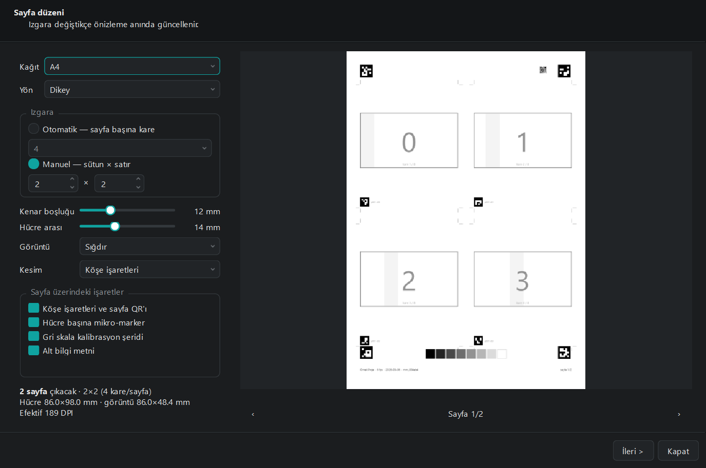
</p>

Sağdaki önizleme **gerçekten basılacak sayfanın kendisidir** — ayrı bir çizim
yolu yoktur, ne görüyorsanız o basılır. Sayfalar arasında `‹` `›` ile gezinin.

| Ayar | Açıklama |
|---|---|
| **Kağıt / Yön** | A4, A3, Letter · Dikey veya Yatay |
| **Izgara → Otomatik** | Sayfa başına kaç kare istediğinizi söylersiniz; sistem en çok basılı alanı veren sütun×satır düzenini ve yönü kendi seçer |
| **Izgara → Manuel** | Sütun ve satırı kendiniz girersiniz |
| **Kenar boşluğu / Hücre arası** | Kesmek için pay bırakır |
| **Görüntü** | *Sığdır* kareyi tam gösterir, *Doldur* hücreyi doldurur (kenarlardan kırpar) |
| **Kesim** | Köşe işaretleri, ince çerçeve veya hiçbiri |

Sol alttaki özet iki şeyi söyler:

- **Kaç sayfa çıkacağı** ve hücre ölçüleri.
- **Efektif DPI** — kareler kağıda kaç DPI ile basılacak. Bu sayı sarıya
  dönerse ("baskıda yumuşak görünecek") ya sayfa başına daha az kare seçin ya da
  daha büyük kağıda geçin.

#### Sayfa üzerindeki işaretler

Bu kutudaki dört seçenek uygulamanın kareleri geri bulmasını sağlar:

| İşaret | Ne işe yarar |
|---|---|
| **Köşe işaretleri ve sayfa QR'ı** | Sayfayı tanır, eğriliği ve perspektifi düzeltir |
| **Hücre başına mikro-marker** | Her karenin kimliğini taşır; kesip ayırsanız bile kaybolmaz |
| **Gri skala kalibrasyon şeridi** | Tarayıcı/yazıcı renk kaymasını düzeltir |
| **Alt bilgi metni** | Proje adı, fps, tarih, sayfa numarası |

> ⚠️ **Bunları kapatmayın.** Estetik gerekçeyle kapatabilirsiniz, ama o zaman
> uygulama taramaları otomatik hizalayamaz ve her sayfanın dört köşesini elle
> göstermeniz gerekir. Kapattığınızda zaten sarı bir uyarı çıkar.

### Adım 4 — Çıktı

<p align="center">
  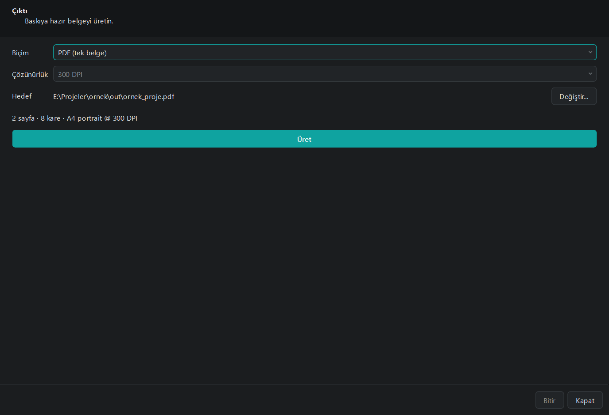
</p>

**Biçim** olarak *PDF (tek belge)* seçin — matbaaya veya yazıcıya vereceğiniz
budur. Bazı baskıcılar sayfa başına ayrı dosya ister; o zaman *Sayfa başına PNG*
seçip çözünürlüğü belirleyin.

**Üret**'e basın, bitince **Klasörü aç** ile dosyaya ulaşın.

#### Yazdırırken dikkat

Bu en kritik noktadır:

> 🖨️ **Yazıcı ayarlarında ölçekleme KAPALI olmalı.**
> "Sayfaya sığdır", "Fit to page", "Shrink oversized pages" gibi seçenekler
> **kapalı**, ölçek **%100 / Gerçek boyut (Actual size)** olmalıdır.

Yazıcı sayfayı %97'ye küçültürse kağıttaki ölçüler projedeki ölçülerle
uyuşmaz ve kareler yanlış kesilir. Bir sayfa deneme basıp cetvelle ölçmek
iyi bir alışkanlıktır.

---

## 2. Bölüm — Kağıt üzerinde çalışma ve tarama

### Çalışırken

- **Köşe işaretlerini ve QR'ı boyamayın.** Kareler üzerinde istediğinizi
  yapabilirsiniz, ama sayfanın köşelerindeki siyah kareler ile sağ üstteki QR
  kodu okunur kalmalı. Alt kenardaki gri şerit de öyle.
- Kareleri kesip ayırmak isterseniz sorun değil — her karenin altındaki küçük
  işaret kimliğini taşır. Ayrıntı için
  [Kesilmiş kart modu](#kesilmiş-kartla-çalışmak).

### Tararken

| Konu | Öneri |
|---|---|
| **Çözünürlük** | **300–600 DPI** yeterlidir. Daha yükseği kaliteyi artırmaz, sadece yavaşlatır |
| **Renk** | Renkli tarayın (gri tonlamaya uygulama kendi karar verir) |
| **Çerçeve** | **Sayfanın tamamı kadraja girsin.** Kenarları kırpılan taramada köşe işaretleri kaybolur ve hizalama yapılamaz |
| **Otomatik düzeltme** | Tarayıcının "otomatik kırp", "otomatik düzelt", "arka planı temizle" seçeneklerini **kapatın** — uygulama bu işi zaten ve daha doğru yapıyor |
| **Biçim** | PNG veya TIFF tercih edin; JPEG de olur. Çok sayfalı PDF de kabul edilir |
| **Sıra** | **Önemsiz.** Sayfaları karışık sırayla, hatta ters tarayabilirsiniz |

---

## 3. Bölüm — Videoya dönüştürme (EXPORT)

Yine dört adım.

### Adım 1 — Proje

<p align="center">
  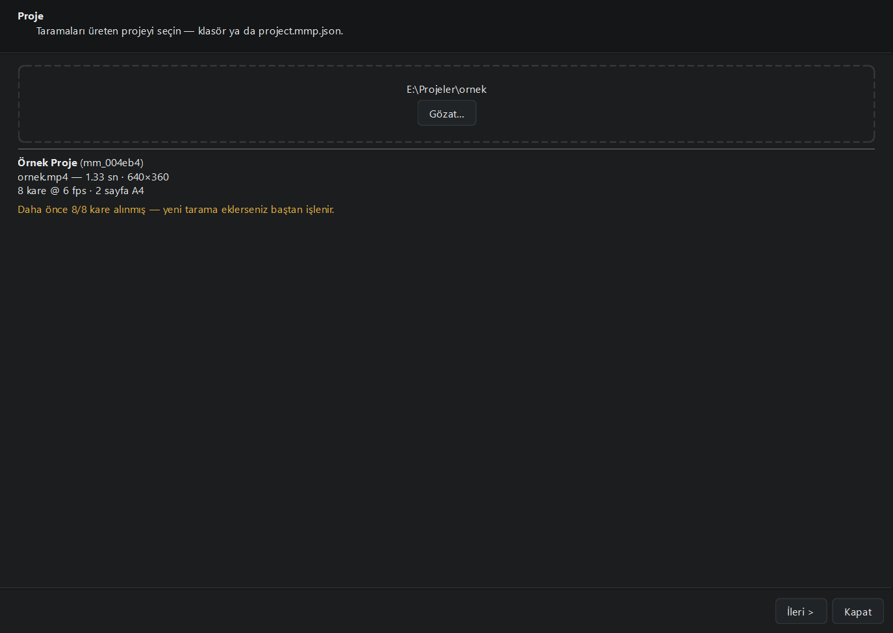
</p>

Taramaları **hangi projeden** çıktığını söylersiniz. Ana menüden bir proje açıp
geldiyseniz bu adım zaten doludur.

Bu adım şart, çünkü uygulama hiçbir şeyi tahmin etmez: her karenin sayfadaki
yerini ve sırasını proje dosyasından okur.

### Adım 2 — Taramalar

<p align="center">
  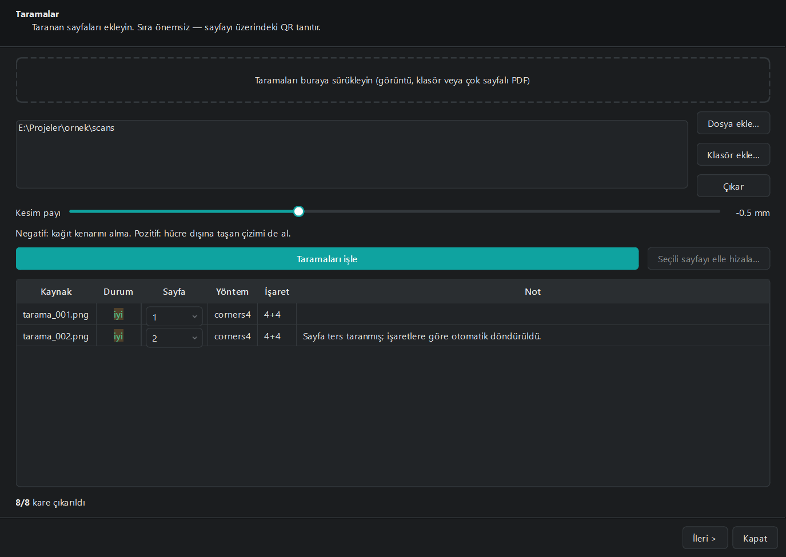
</p>

Taradığınız dosyaları sürükleyip bırakın (tek tek görüntü, bir klasör veya çok
sayfalı PDF olabilir), sonra **Taramaları işle**'ye basın.

Tablodaki her satır bir taramadır:

| Sütun | Anlamı |
|---|---|
| **Durum** | 🟢 *iyi* · 🟡 *orta* / *zayıf* · 🔴 *okunamadı* |
| **Sayfa** | Hangi sayfa olduğu. QR okunmadıysa buradan elle seçebilirsiniz |
| **Yöntem** | `corners4` = dört köşe okundu (en iyi), `cell_markers` = yalnızca hücre işaretleriyle hizalandı |
| **İşaret** | Kaç köşe + kaç hücre işareti bulundu |
| **Not** | Uyarılar. Örnekteki *"Sayfa ters taranmış; işaretlere göre otomatik döndürüldü"* gibi |

En altta **kaç kare çıkarıldığı** yazar. Hepsi bulunduysa devam edin.

> **Kesim payı** kaydırıcısı hücrelerin nereden kesileceğini ayarlar.
> Negatif değer kağıt kenarından içeri kaçar (varsayılan −0.5 mm, kenar
> çizgisinin görüntüye karışmasını engeller). Hücre dışına taşan çizimlerinizin
> de alınmasını istiyorsanız pozitif bir değer verin.

### Adım 3 — Kareler

<p align="center">
  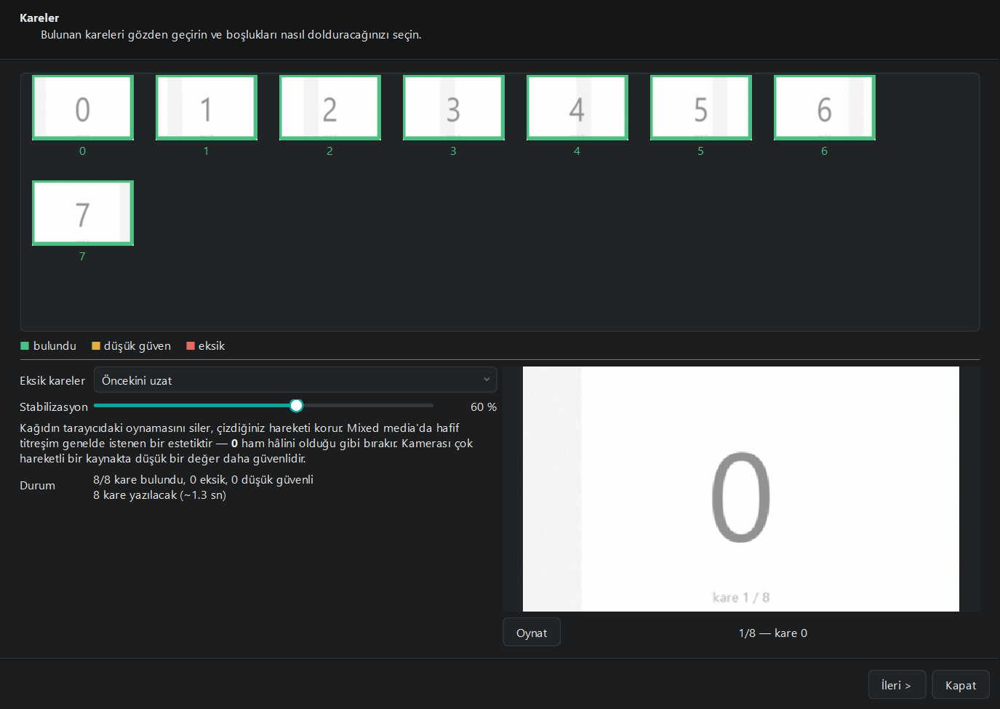
</p>

Üstteki şerit her kareyi renk koduyla gösterir:
🟢 bulundu · 🟡 düşük güven · 🔴 eksik.

Sağdaki **Oynat** düğmesi animasyonu gerçek hızında oynatır — dosyaya yazılacak
olanın birebir aynısını izlersiniz.

**Eksik kareler** — bir kare bulunamazsa ne yapılacağını seçersiniz:

| Seçenek | Sonuç |
|---|---|
| **Öncekini uzat** | Bir önceki kare iki kare süre kalır (en doğal, önerilen) |
| **Atla** | Kare hiç yazılmaz — video kısalır, tempo değişir |
| **Ara geçiş üret** | Komşu karelerden bir ara görüntü hesaplanır |
| **Kırmızı kare** | Eksik yer kırmızı basılır — hangi karenin eksik olduğunu görmek için |

**Stabilizasyon** — kağıdın tarayıcıda her seferinde birkaç milimetre farklı
durmasından kaynaklanan titremeyi siler.

> Mixed media'da hafif titreşim genelde **istenen** bir estetiktir. Ham hâlini
> korumak isterseniz **0** yapın. Kaynak videosu çok hareketli işlerde de düşük
> bir değer daha güvenlidir.

### Adım 4 — Video

<p align="center">
  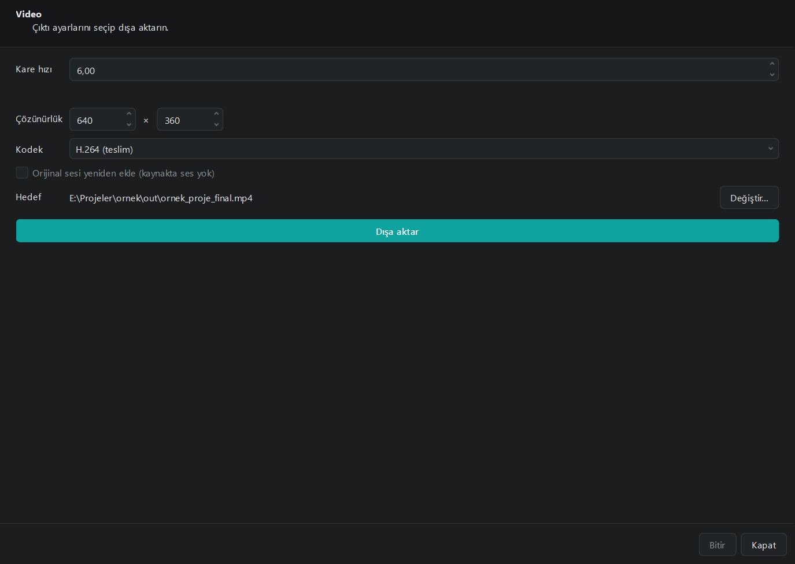
</p>

| Ayar | Açıklama |
|---|---|
| **Kare hızı** | Videonun oynatma hızı |
| **Çözünürlük** | Varsayılan olarak kaynak videonun boyutu |
| **Kodek** | *H.264* → paylaşmak için · *ProRes 422 HQ* → montaja devam edecekseniz · *PNG sekansı* → kare kare dosya |
| **Orijinal sesi yeniden ekle** | Kaynak videonun sesini geri koyar |

> ⏱️ **Hız uyarısı.** Kareleri 6 fps'te çıkarıp videoyu 12 fps'te verirseniz
> hareket iki kat hızlanır. İki değer farklıysa uygulama sarı bir uyarıyla
> "hareket **2×** hızlanacak" der. Bunu bilerek yapıyorsanız sorun yok.

**Dışa aktar**'a basın. Bitince **Klasörü aç** ile videoya ulaşın.

🎉 Döngü tamamlandı.

---

## Özel durumlar

### Kesilmiş kartla çalışmak

Kareleri kesip ayrı ayrı çalıştıysanız (kolaj, farklı zeminlere yapıştırma vb.)
kartları tarayıcıya dağınık şekilde koyup tarayabilirsiniz. Her kartın altındaki
mikro-marker kimliğini taşır; uygulama sayfayı bulamayınca kendiliğinden kart
moduna geçer.

Dikkat edilecek tek şey: **kartların altındaki küçük kareyi kesmeyin.** Kesim
işaretlerinin dışından keserseniz zaten sorun olmaz.

### İşaretsiz basıp elle hizalamak

İşaretleri estetik gerekçeyle kapattıysanız otomatik tespit çalışmaz. Bu durumda
**Taramalar** adımında tablodan bir satır seçip **Seçili sayfayı elle hizala…**
düğmesine basın. Açılan pencerede sayfanın dört köşesini sürükleyerek
gösterirsiniz; ızgara projedeki ölçülerden üstüne bindirilir.

Baskı kağıda kaymış oturduysa alttaki **Izgarayı yatay/dikey kaydır**
kaydırıcılarıyla milimetre milimetre düzeltebilirsiniz.

**Bu hizalamayı sonraki taramalara da uygula** kutusu işaretliyse aynı köşeler
sonraki sayfalara da uygulanır — tarayıcıda kağıt genelde aynı yere konduğu için
bu çoğu zaman işe yarar ve her sayfayı baştan işaretlemekten kurtarır.

---

## Sorun giderme

<table>
<tr><th align="left">Belirti</th><th align="left">Nedeni ve çözümü</th></tr>

<tr><td><b>"FFmpeg bulunamadı"</b> — ana ekranda kırmızı uyarı</td>
<td>FFmpeg kurulu değil. <a href="#2-ffmpeg-kurun-zorunlu">Kurulum bölümüne</a>
bakın. Kurduktan sonra uygulamayı yeniden başlatın.</td></tr>

<tr><td><b>"Köşe işaretleri bulunamadı"</b></td>
<td>Büyük olasılıkla tarama sayfanın kenarlarını kırpmış. Sayfanın tamamı
kadraja girecek şekilde yeniden tarayın. Tarayıcının otomatik kırpma ayarını
kapatın. Kareleri kesip ayırdıysanız zaten kart modu devreye girmeli.</td></tr>

<tr><td><b>"Sayfa QR'ı okunamadı"</b></td>
<td>Genelde önemsiz — uygulama sayfa numarasını tarama sırasından çıkarır.
Yanlış eşleşirse <b>Taramalar</b> tablosundaki <b>Sayfa</b> sütunundan doğru
numarayı elle seçip yeniden işleyin.</td></tr>

<tr><td><b>"Sayfa düzeni, bu sayfalar basıldıktan sonra değişmiş"</b></td>
<td>PDF'i bastıktan sonra ızgara ayarlarını değiştirmişsiniz. Kağıttaki kareler
artık projedeki koordinatlara uymuyor. Ya yerleşimi baskıdaki hâline geri alın,
ya da güncel yerleşimle yeni bir PDF üretip yeniden bastırın.</td></tr>

<tr><td><b>Kareler yanlış yerden kesilmiş</b></td>
<td>Yazıcı sayfayı ölçeklemiş olabilir. Yazdırırken ölçeğin <b>%100 / Gerçek
boyut</b> olduğundan emin olun.</td></tr>

<tr><td><b>Video kenarlarından kayıyor / titriyor</b></td>
<td><b>Kareler</b> adımında <b>Stabilizasyon</b>'u düşürün veya <b>0</b> yapın.
Kaynak videosu çok hareketli işlerde stabilizasyon faydadan çok zarar
verebilir.</td></tr>

<tr><td><b>Baskı çok soluk veya çok koyu</b></td>
<td><b>Görünüm</b> adımındaki <b>Baskı yoğunluğu</b>'nu ayarlayın. Her yazıcı
farklıdır; bir sayfa deneme basmakta fayda var.</td></tr>

<tr><td><b>Taramadan çıkan kareler kalitesiz</b></td>
<td>Taramayı 300–600 DPI yapın ve tarayıcının otomatik düzeltme seçeneklerini
kapatın. Kalibrasyon şeridini basılı bıraktığınızdan emin olun — renk kaymasını
o düzeltiyor.</td></tr>

<tr><td><b>Arayüz İngilizce/Türkçe kaldı</b></td>
<td>Ana menü sağ üstündeki 🌐 düğmesinden değiştirin. Değişiklik anında
uygulanır.</td></tr>
</table>

---

## Komut satırı

Aynı işlerin tamamı `mm.exe` ile de yapılabilir — çok sayıda projeyi toplu
işlemek veya betik yazmak için kullanışlıdır.

Uygulamayı hiç video hazırlamadan denemek isterseniz, örnek bir proje kurup
döngünün tamamını çalıştırabilirsiniz:

```powershell
mm example ornek --frames 8
mm ingest ornek/scans -p ornek
mm video -p ornek
```

Bu üç komut sonunda `ornek/out/` klasöründe hem baskı PDF'i hem de video olur.

Diğer komutlar için:

```powershell
mm --help
```

> Komut satırı arayüzü şimdilik yalnızca Türkçedir.

---

## Bilinen sınırlar

- Arayüz **Türkçe** ve **İngilizce**; `mm.exe` yalnızca Türkçe.
- FFmpeg uygulamayla birlikte gelmez, ayrıca kurulmalıdır.
- Program dijital olarak imzalı değildir; Windows ilk açılışta uyarı verir.
- Yalnızca Windows derlemesi hazırdır. Kaynaktan çalıştırma macOS ve Linux'ta da
  destekleniyor (bkz. [README.md](README.md)).
